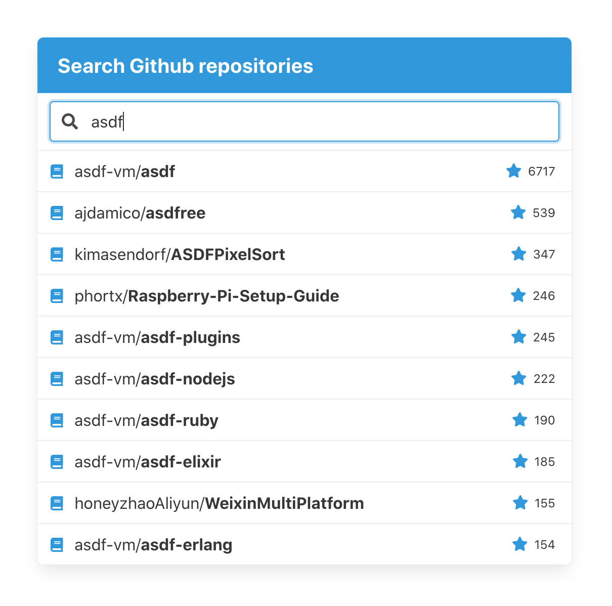

# Repo-Search



This project is a single-page application that allows to search public Github repositories.

## Local configuration

To make 30 search request per minute instead of 10, you can configure the application to use Github API token.

[Guide on creating an API token](https://help.github.com/en/github/authenticating-to-github/creating-a-personal-access-token-for-the-command-line)

Token must be then added to `build/docker/app/dev.env.private` (username:token):

```bash
GITHUB_API_CREDENTIALS=y9v:TOKEN
```

## Running the app

Dependencies:
  - Docker

To build and start the application, simply run (assuming port 4444 is not taken):

```bash
docker-compose up
```

After the Rails app is loaded, open [http://localhost:4444](http://localhost:4444)

## Running tests

To run tests in Docker environment:

```bash
docker-compose run --rm dev rspec
```
